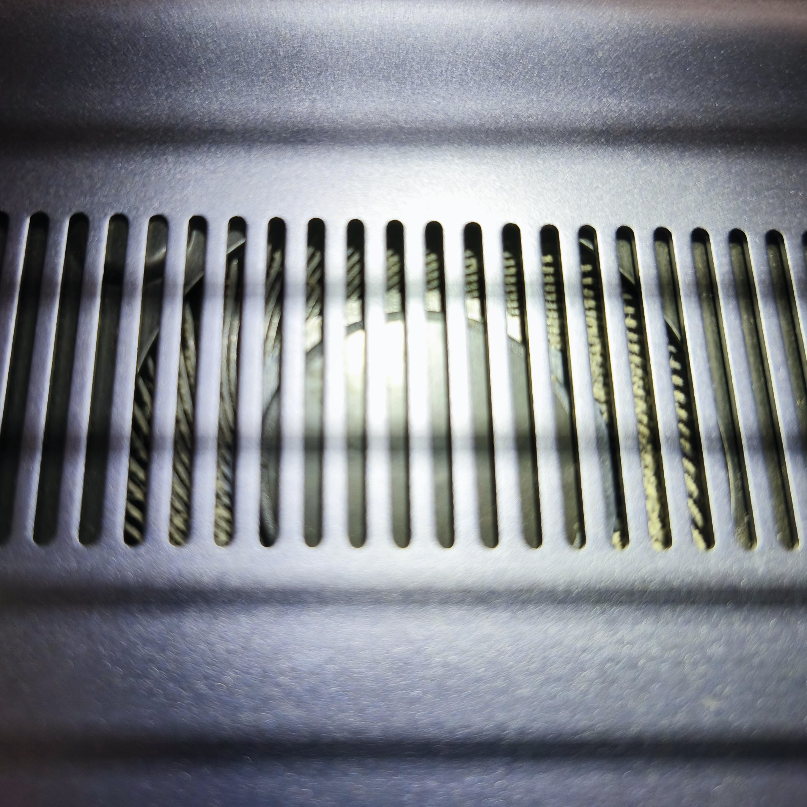
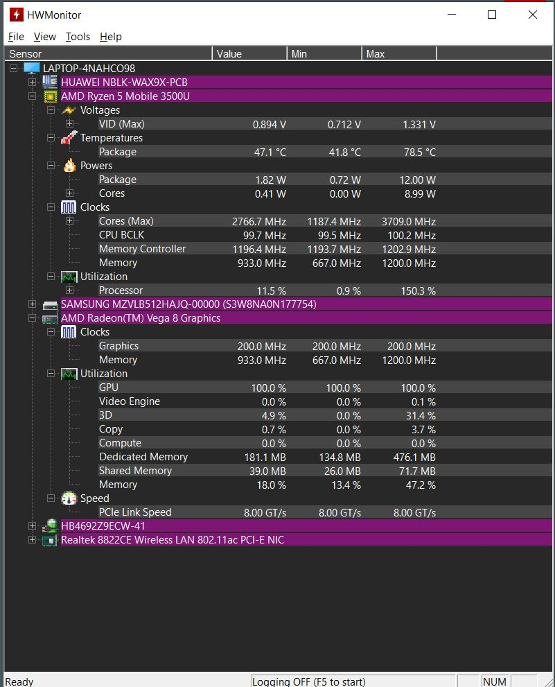
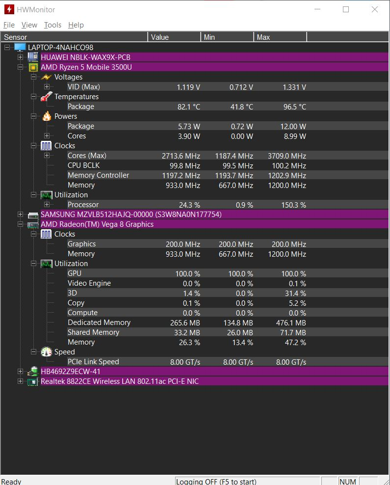

## 🛠️ Preventive Maintenance Report

**Date:** July 10, 2026 to July 15, 2026

---

### 📌 Objective

Preventive maintenance on a personal-use Huawei MateBook D14 (2021) laptop.

---

### 📜 Background

The device was exhibiting elevated temperatures during high-performance tasks, such as rendering/exporting high-resolution videos or playing demanding video games. I first noticed this temperature spike while playing online gaming sessions with my kids.

From its purchase in 2021 until July 2026, the laptop had never undergone physical maintenance (neither dust cleaning nor thermal paste replacement).

---

### 🚨 Symptoms

* Visible dust build-up inside the cooling fan upon visual inspection.
* High surface temperatures noticeable to the touch around the keyboard area.
* On one occasion, the device executed a preventive shutdown to avoid permanent damage to the processor (CPU) or graphics card (GPU).

  

---

### 🔍 Diagnostic (10.07.2026)

**A)** I performed a thermal performance diagnostic to verify the state of the cooling system with real metrics, using the following software:

* **HWMonitor:** to observe and record temperature changes of the system at idle and under demanding tasks.
* **Cinebench R23:** as a system stressor running the CPU Multi Core test, which forces all cores and threads to work at 100%. The software is compatible with the laptop, which features an AMD Ryzen 5 3500U Processor (4 cores / 8 threads).

  

**B) Test sequence:**

1. Starting with a cold laptop and no other programs open, I recorded the temperature for 5 minutes at idle.
2. I started the 10-minute stress test in Cinebench R23 while HWMonitor recorded the activity.
3. I stopped recording once the test finished.

**C) Results obtained:**

* **Minimum Temperature (Min) when cold:** 41.8 °C
* **Idle Temperature (Value):** 47.1 °C
* **Maximum Temperature reached under stress:** ⚠ 96.5 °C

  
  

#### Diagnostic conclusions

* **At idle (47.1 °C):** Elevated. Normal idle temperatures should range between 35 °C and 42 °C.
* **Under stress (96.5 °C):** Red alert. Expected temperature under load should range between 78 °C and 85 °C if heat is properly dissipated.
* **Evident risk:** The absolute destruction limit for this AMD processor is 105 °C, and Huawei programs the device to activate alarms or shut down upon crossing 95 °C. The processor was cutting power (*thermal throttling*) to avoid burning out. I presume the thermal paste could be dry from years of use and dust could be preventing proper ventilation.

---

### 💡 Solution

Open the device, replace the thermal paste, and perform a deep cleaning of the cooling fan and ventilation grilles.

---

### 🧰 Tools and Materials

#### A) Tools:

* Anti-static ESD wrist strap (to prevent discharges that damage components).
* Precision screwdriver set with magnetic bits and opening tools (*opening picks*).
* Plastic model building engraving and cutting tool (chisel-type, to recut stripped screw heads).
* Magnifying glasses for small components.
* Anti-static brushes.
* Vacuum cleaner and adjustable electric dust blower for PCs.
* Precision needle-nose pliers.

#### B) Materials:

* ARCTIC MX-7 thermal paste (4g).
* M2x2.5 screw set (replacements).
* Cleaning cloths and cotton swabs.
* Isopropyl alcohol.

---

### ⚙️ Step-by-Step Procedure

1. Worked on an anti-slip rubber mat and kept my phone handy to photograph the position of each component before intervening.
2. Put on the anti-static wrist strap connected to ground (later to the internal USB connector once the device was opened).
3. Removed the chassis screws and organized them sequentially.
4. Using the *opening pick*, gently opened the side clips.
5. ⚠️ **Disconnected the battery as the first safety step** after the initial visual inspection.
6. Identified the components and critical points to clean: cooling fan, heatsink, and ventilation grilles.
7. Determined the disassembly sequence after reviewing support documentation and videos: Wi-Fi antenna cables, heatsink, fan.
8. ⚠️ **Critical Problem:** 2 of the 4 screws securing the heatsink to the processor were stripped/barred. Exposed to constant temperature changes, they suffered thermal fatigue, weakening the material.
9. **Problem Resolution:** Temporarily aborted maintenance, cleaned surface area, reconnected the battery, closed the device, and ordered a replacement set of M2x2.5 screws.
10. **15.07.2026:** With the new screws in hand, I opened the device again.
11. To remove the stripped screws without risking the motherboard using aggressive methods, I used the angled cutting chisel from my plastic models to redefine the screw head with patience. I managed to turn them slightly until unseated and removed them in a cross pattern (diagonal) using precision needle-nose pliers.
12. Removed heatsink and fan.
13. Cleaned dust and lint from fan blades and ventilation grilles using brushes and the electric blower.
14. Cleaned off dry thermal paste from processor and heatsink using isopropyl alcohol and cotton swabs until completely spotless.
15. Applied the new ARCTIC MX-7 thermal paste.
16. Mounted the components and heatsink, adjusting screws in an "X" pattern two turns first, then gave them final adjustment applying the "snug plus a quarter turn" rule without forcing.
17. Verified connections against initial reference photos, reconnected the battery, and closed the chassis.

---

### 📊 Subsequent Performance Test

I conducted a new performance test under the exact same parameters, producing the following results:

| Measurement | Before Maintenance | After Maintenance |
| --- | --- | --- |
| **Minimum Temperature (Min)** | 41.8 °C | 37.5 °C |
| **Idle Temperature (Value)** | 47.1 °C | 40.4 °C |
| **Maximum Temperature (Stress)** | 96.5 °C | 69.1 °C |

---

### 💡 Conclusion

Preventive maintenance and thermal paste replacement achieved a drastic reduction of 27.4 °C under maximum load. The risk of overheating and sudden shutdowns was completely eliminated, restoring optimal processor performance, ensuring system stability, and extending the laptop's service life.

---
