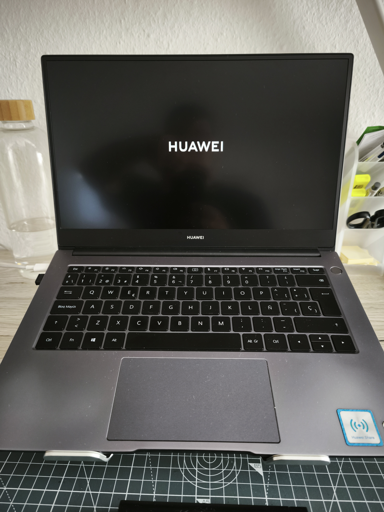
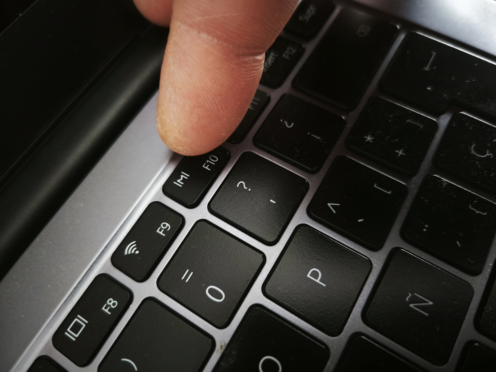
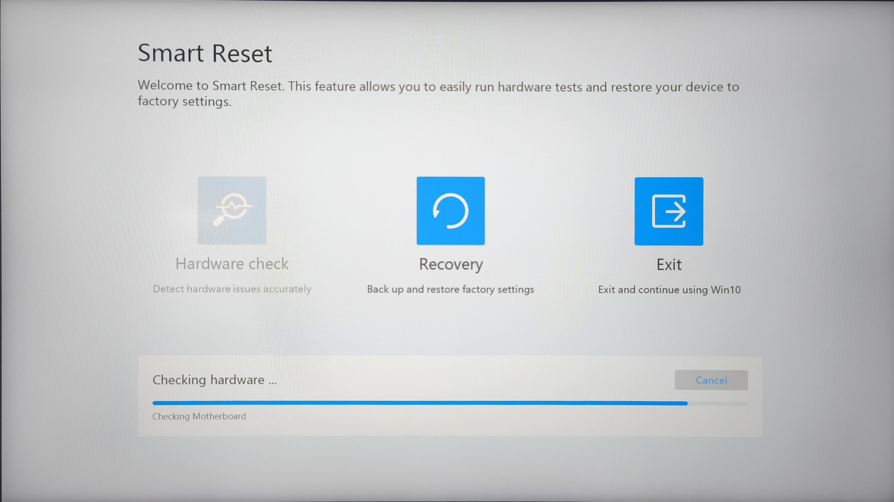
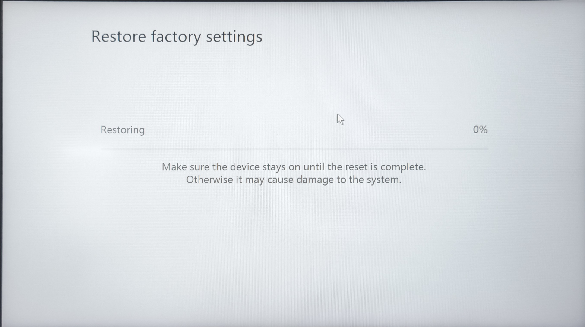
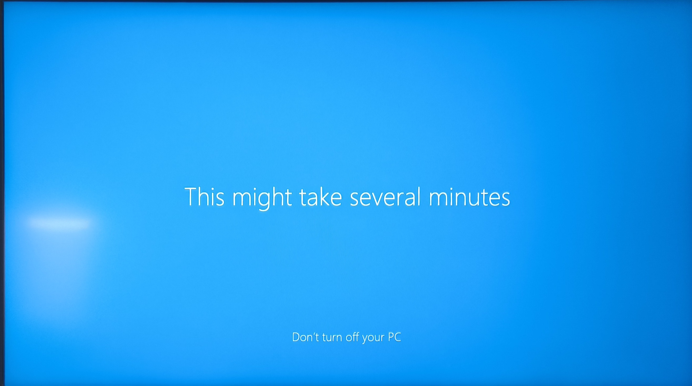

## 💻 Formatting & OS Optimization Report

**Date:** July 04, 2026.

---
### 📌 Objective

Annual formatting and optimization of personal-use laptop Huawei Matebook D14 (2021), with the purpose of restoring operating system integrity by eliminating "system rot", disabling unnecessary services to reduce resource consumption (RAM and CPU), and guaranteeing security through reinstallation from the official media.

---
### 📜 Background

The equipment presents accumulation of temporary files, orphaned registry entries, and software residue from installations and uninstallations that have slowed down the device. From personal experience, at least every year I format my personal laptop to maintain its performance in optimal conditions and working only with the essential software and documents that I need for my daily activities.

In addition, I plan to use the Chris Titus Tech tool (CTT WinUtil) which disables unnecessary services (Cortana, Xbox Live Services, telemetry tracking) and bloatware applications preinstalled by the manufacturer or Microsoft in Windows 10, which would reduce idle RAM usage, background running processes, and provide greater data privacy.

According to what I have researched, furthermore, by reducing background processes, the CPU consumes fewer watts at idle, decreasing thermal load and extending the lifespan of the battery and processor.

---
### 🚨 Symptoms

Approximately 39% of memory used at idle.
General slowdown of the device.

---
### 🧰 Tools used

- Huawei Intelligent Recovery, native tool of the equipment.
- PowerShell for executing the optimization script.
- Chris Titus Tech Windows Utility: `irm https://christitus.com/win | iex`

---
### ✍ Note:
Although the process of formatting and reinstalling Windows through its native tool is practically automatic, I wanted to document it to demonstrate that I know how to do it and that I care about keeping the equipment under my charge or belonging to my family in optimal condition. 

When I was a child, about 25-30 years ago, I learned out of necessity.

My first computer was an unbranded "386" desktop PC with Windows 3.1, while my friends already had a "Pentium" PC with Windows 95 from brands like Packard Bell or Compaq Presario. I got Windows 95 on floppy disks from my older brother's friends and there I ran into my first problems, because the installation checked if you met the minimum hardware requirements. Although I was able to do it, I didn't have the same experience as my friends on my old PC.

That's where it all started.

Years later, my brother would buy PCs at a department store that had been on display or that customers returned due to faults. When my brother managed to buy them, warehouse employees had already removed the most expensive parts, forcing my brother to buy several and forcing me to build true Frankensteins with borrowed components that were compatible. Everything was trial and error, and much harder because you had to learn to work with the BIOS so it would recognize certain components, "jumper" storage and reading drives (hard drives, floppy disks and, in the best case, CD drives); then I had to format, install Windows and the worst part: search for and install drivers. Some components had no indication of brands or models, so I had to search through any clue that the operating system or physical component on its board could give me, such as a brand name, model, or serial number, and then compare.

So yes, I know how to do this procedure that is easy now, and I am grateful that it is that way.

---
### ⚙️ Step-by-Step Procedure

1. Make a backup copy on an external drive of all the files that are important to me and that I am certain I will continue using in the future (Photos, text documents, videos, books, etc.).
2. Make sure the equipment is connected to a power source to prevent it from turning off in the middle of the installation, as this could be harmful and damage the system.
3. Turn off the equipment. Restart and, while it restarts, repeatedly press the F10 key to start the "Smart Reset" program.

  
  

4. The system will format the C drive, of which I already backed up the important files.
5. Start the factory reset. The equipment will take a few minutes for the operation. Upon completion, it will restart automatically.
6. 

  
  
  

7. The system will start the version of Windows with the basic manufacturer configuration.
8. Through the manufacturer's software (Huawei) "PC Manager", we will do a first general Hardware check, then a driver check.
9. After analyzing the missing drivers, I download their updated versions, which are installed automatically.
10. I review all preinstalled Windows software in the system and begin their uninstallation, for example this unlicensed version of the Microsoft Office suite, since I will install the open source office suite, OnlyOffice. 
11. I install Windows updates which, among other things, contain security patches.
12. I install the official Microsoft PC Manager app, to clean, speed up and optimize the operating system. Although it is not available in Europe, I change my location to the United States and download and install the app from the Microsoft Store.
13. Once I have Windows optimized with the processes I know, I look for the Chris Titus tool, officially "WinUtil", which is an open source PowerShell-based script designed to optimize, clean (debloat) and customize Windows 10 (and 11). The tool is considered safe and has wide support from the technical community.
14. I run WinUtil according to the creator's instructions and select Tweaks-->Standard, in addition to selecting some boxes in Advanced Tweaks mode such as Microsoft OneDrive (which I do not use), Microsoft Edge - Remove, Background Apps - Disable, among others.
15. I apply the changes and restart. 
16. Everything has turned out well and successfully.

---
### 📊 Results

- Reduced idle RAM consumption from 39% to 34%, increasing its availability.
- Deleted OneDrive and unnecessary apps or games that Microsoft includes by default and that only take up disk space.
- Removed Microsoft Edge and its automatic update system so it doesn't reinstall itself.
- Prevented Windows background applications (like Mail or Weather) from running covertly, saving RAM and battery.
- Disabled tracking services and data sending to Microsoft, freeing up bandwidth and protecting part of my privacy.
- Removed Bing results from the internal search bar (now it searches only my local files immediately) and removed news widgets from the taskbar, contributing to a more agile Start Menu.
- Turned off secondary system services (such as automatic error reporting) to free up processor load.
- Disabled hibernation to recover several gigabytes of space and made registry adjustments to turn the laptop on and off faster.
- By formatting, all ghost data, old caches, and remnants of previous updates were erased, recovering real storage space.

---
### 💡 Conclusion

Although current tools allow me to perform restorations of my equipment almost automatically, this small project partly demonstrates my affinity and confidence in intervening in computer systems. Having learned self-taught out of necessity since the 386 processor era, installing and configuring components and drivers (after research), today I continue applying the same philosophy of diagnosis, maintenance, and care for my equipment in modern environments.

This intervention, which served as a laboratory to document, was not limited to a conventional format, but to a deep optimization that eliminated ghost services, data tracking, and unnecessary resource consumption.

The result is, as every once in a while, the peace of mind of working on an efficient operating system optimized to the measure of my interests and goals.
